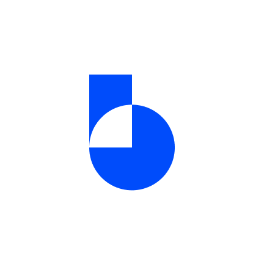

# boros_app



Monthly expense companion to track, budget, and reset.

## Getting started with Isar Database

This app is utilizing the Isar Database, here is the resource to get started with it:

- [Isar Database: Super fast cross-platform database for Flutter](https://isar.dev/)

## Recommended VS Code workspace settings

Use the following code in your `.vscode/settings.json` file. If the file doesn't exist, you can create it in the root directory of your project.

```json
{
    "material-icon-theme.folders.associations": {
        "collections": "database",
    },
    "files.exclude": {
        "**/*.freezed.dart": true,
        "**/*.g.dart": true
    }
}
```

## Getting started with Flutter

A few resources to get started with Flutter project:

- [Lab: Write your first Flutter app](https://docs.flutter.dev/get-started/codelab)
- [Cookbook: Useful Flutter samples](https://docs.flutter.dev/cookbook)

For help getting started with Flutter development, view the
[online documentation](https://docs.flutter.dev/), which offers tutorials,
samples, guidance on mobile development, and a full API reference.

## Extra resources

Another resources about Flutter:

- [Flutter tips & tricks](https://github.com/vandadnp/flutter-tips-and-tricks)
- [Highly subjective roadmap to Flutter development](https://github.com/olexale/flutter_roadmap)
